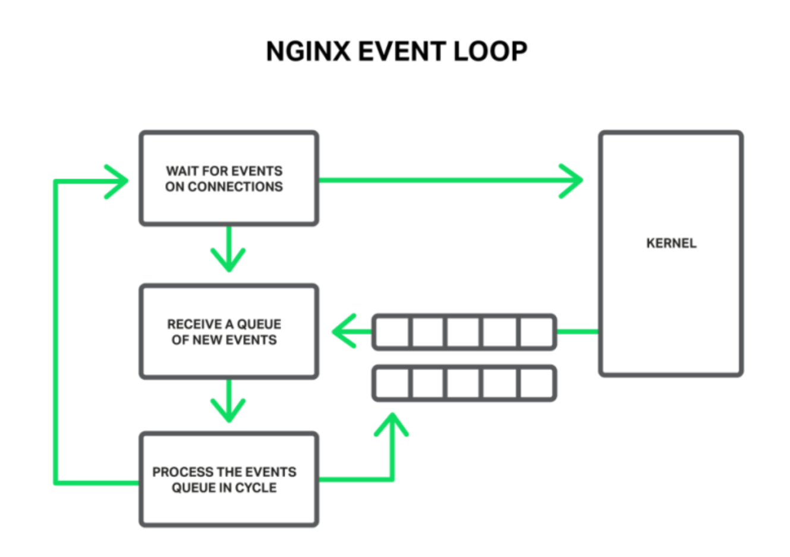
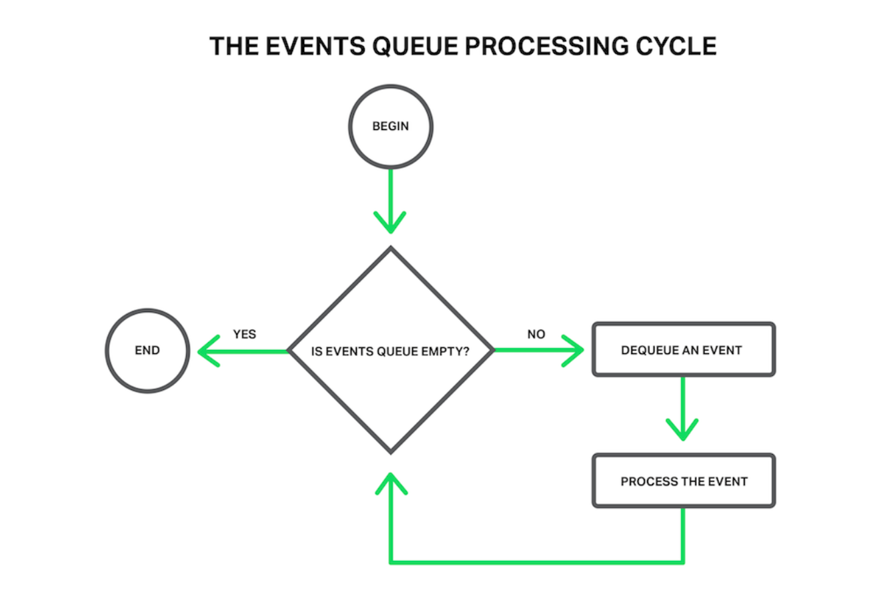

# Events

---

## Event

***

nginx中的事件对象 **ngx_event_t** 提供了一种通知特定事件已经发生的机制。

**ngx_event_t** 中的字段包括：

- data —— 事件处理程序中使用的任意事件上下文，通常作为指向与该事件相关的连接的指针。
- handler —— 事件发生时调用的回调函数。
- write —— 指示写入事件的标志。（没有表示读取事件的标志）
- active —— 指示事件注册为接收I/O通知的标志，通常来自epoll、kqueue、poll等通知机制。
- ready —— 指示事件已经接收到I/O通知的标志。
- delayed —— 指示由于速率限制I/O延迟的标志。
- timer —— 红黑树节点，用于将事件插入到计时器树中。
- timer_set —— 指示计时器已设置且未过期的标志。
- timeout —— 指示计时器已过期的标志。
- eof —— 指示读取数据时发生EOF的标志。
- pending_eof —— 指示EOF在套接字上挂起的标志，即使在此之前可能有一些数据可用。通过EPOLLRDHUP epoll事件或EV_EOF kqueue标志传递。
- error —— 指示在读事件或写事件期间发生错误的标志。
- cancelable —— 定时器事件标志，指示在关闭辅助器时应忽略该事件。graceful worker shutdown 被延迟，直到没有不可取消的计时器事件被安排。
- posted —— 指示将事件发送到队列的标志。
- queue —— 用于将时间发送到队列的队列节点。

nginx 刚启动时，在 wait for events connections 处打开80或443端口，等待新的事件进来，比如新的客户端连接请求（epoll wait），这时 nginx 处于 sleep 状态。当操作系统接收到了一个建立TCP连接的握手报文并且处理完握手流程之后，操作系统就会通知 epoll wait ，告诉他现在可以往下走了，同时唤醒worker进程。处理完一个事件之后，操作系统会把他准备好的事件放到事件队列中，从这个事件队列可以获取到一个要处理的事件，从队列中取出来，然后再开始处理事件。




## I/O events

---

通过调用 **ngx_get_connection()** 函数获得的每个连接都有两个附加事件：**c->read** 和 **c->write** ，它们用于接收套接字已经准备好进行读写的通知。所有这些事件都在 Edge-Triggered 模式下运行，这意味着它们只在套接字状态变更时触发通知。例如，在套接字上执行部分读操作并不会使 nginx 在更多数据到达套接字之前传递重复的读通知。即使底层的 I/O 通知机制本质上是 Level-Triggered （poll、select等），nginx 也会将通知转换为 Edge-Triggered . 要使 nginx 事件通知再不同平台上的所有通知系统中保持一致，必须在处理 I/O 套接字通知或调用该套接字上的任何 I/O 函数之后调用 **ngx_handle_read_event(rev, flags)** 和 **ngx_handle_write_event(wev, lowat)** 函数。通常，这些函数在每个读事件或写事件处理程序结束时调用一次。

## Timer events

---

可以将事件设置为在超时过期时发送通知。事件使用的计时器从过去截断为 **ngx_msec_t** 类型的某个未指定点开始计算毫秒。它当前的值可以从 **ngx_current_msec** 变量获得。

函数 **ngx_add_timer(ev, timer)** 为事件设置超时，**ngx_del_timer(ev)** 删除先前设置的超时。全局超时红黑树 **ngx_event_timer_rbtree()** 储存当前设置的所有超时。树中的关键类型为 **ngx_msec_t** ，表示事件发生的时间。红黑树的结构支持快速插入和删除操作，以及访问最近的超时，nginx 使用超时来确定等待 I/O 事件和过期超时事件的时间。

## Posted events

---

事件被发布意味着它的处理程序将在当前事件循环迭代的某个时刻被调用。发布事件可以简化代码和避免堆栈溢出。已发布的事件保存在发布队列（post queue）中。**ngx_post_event(ev, q)** 将事件 ev 发送到 post 队列 q 。**ngx_delete_posted_event(ev)** 从当前发送到的队列中删除事件 ev 。通常，事件被发送到 **ngx_posted_events** 队列中，该队列会在事件循环（event loop）的后期处理，在处理了所有的 I/O 事件和计时器事件之后。函数 **ngx_event_process_posted()** 被调用来处理事件队列。它调用事件处理程序，直到队列不为空。这意味着发布的事件处理程序可以发布更多要在当前事件循环迭代中处理的事件。

一个例子：
```c
void
ngx_my_connection_read(ngx_connection_t *c)
{
    ngx_event_t  *rev;

    rev = c->read;

    ngx_add_timer(rev, 1000);

    rev->handler = ngx_my_read_handler;

    ngx_my_read(rev);
}


void
ngx_my_read_handler(ngx_event_t *rev)
{
    ssize_t            n;
    ngx_connection_t  *c;
    u_char             buf[256];

    if (rev->timedout) { /* timeout expired */ }

    c = rev->data;

    while (rev->ready) {
        n = c->recv(c, buf, sizeof(buf));

        if (n == NGX_AGAIN) {
            break;
        }

        if (n == NGX_ERROR) { /* error */ }

        /* process buf */
    }

    if (ngx_handle_read_event(rev, 0) != NGX_OK) { /* error */ }
}
```


## Event loop

---

除了 nginx 主进程，所有 nginx 进程都执行 I/O ，因此都有一个event loop事件循环。nginx 主进程花费大部分时间在 **sigsuspend()** 调用中，等待信号到达。nginx 事件循环在 **ngx_process_events_and_timers()** 函数中实现，这个函数反复被调用，直到进程退出。




事件循环有以下几个阶段：

1. 调用 **ngx_event_find_timer()** 查找最接近到期的超时。这个函数找到计时器树中最左边的节点，并返回该节点到期的毫秒数。
2. 使用处理程序来处理 I/O 事件。这个处理程序是由 nginx 配置选择的特定的事件通知机制。这个处理程序至少等待一个 I/O 事件发生，但是只等到下一次超时过期。当发生一个读或写事件时，将设置 **ready** 标志，并且调用事件的处理程序。在 Linux 中，通常使用 **ngx_epoll_process_events()** 处理程序，该程序调用 **epoll_wait()** 来等待 I/O 事件。
3. 调用 **ngx_event_expire_timers()** 来作废计时器。从最左边的元素到最右边的元素迭代计时器树，直到找到未过期的超时。对每个过期的节点，设置 **timeout** 事件标志，重置 **timer_set** 标志，调用事件处理程序。
4. 调用 **ngx_event_process_posted()** 处理发布的事件。该函数重复地从发布的事件队列中删除第一个元素，并调用该元素的处理程序，直到队列为空。

所有的 nginx 进程也都处理信号。信号处理程序只设置调用 **ngx_process_events_and_timers()** 之后已被检查的全局变量。

