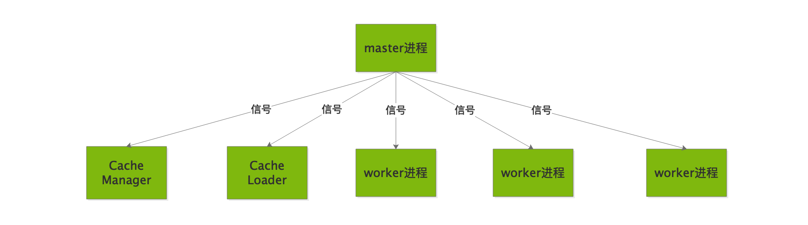

# Process

---

## nginx 进程简介

为了保证 nginx 的高可用高可靠，nginx 被设计成多进程结构。多进程相对于多线程之所以能够保证高可用与高可靠是因为进程间地址空间是独立的，进程间的任务不会相互影响，相对多线程更加耗费 CPU 资源。而多线程共享一个进程的地址空间，其中一个线程任务失败会影响到其它线程任务。

### nginx 进程类型

nginx 中有数种类型的进程。进程的类型保存在 **ngx_process** 全局变量中，介绍如下：

- NGX_PROCESS_MASTER —— 主进程，读取 NGINX 配置，创建 cycles，启动并控制子进程。不执行任何 I/O ，只对信号做出响应。它的 cycle 函数是 ngx_process_cycle() .
- NGX_PROCESS_WORKER —— 辅助进程，处理客户端连接，由主进程启动，并对其信号和通道命令做出响应。它的 cycle 函数是 ngx_worker_process_cycle() . 可以由 worker_processes 指令配置多个 worker 进程。
- NGX_PROCESS_SINGLE  —— 只存在于 master_process off 模式下的单个进程，并且是该模式下运行的的唯一进程。它会像主进程一样创建循环cycles并像辅助进程一样处理客户端连接。它的循环函数是 ngx_single_process_cycle() 。
- NGX_PROCESS_HELPER —— 帮助进程，目前有两种类型：缓存管理器和缓存加载器。这两者的 cycle 函数都是 ngx_cache_manager_process_cycle() 。



### nginx 进程中的信号量

nginx 进程处理以下信号：

- NGX_SHUTDOWN_SIGNAL （在大多数系统上为 SIGQUIT） —— 平滑地关闭。在接收到这个信号之后，master 进程向所有子进程发送一个关闭信号。当没有子进程留下时，主进程销毁循环池并退出。当 worker 进程接收到这个信号，关闭所有监听套接字并等待，直到没有安排不可取消的事件，然后销毁循环池并退出。当缓存管理器或缓存加载器程序进程接收到这个信号之后，将立即退出。当一个进程收到这个信号时，变量 ngx_exit 将置为 1 ，并且在被处理之后立即重置。当 worker 进程处于关闭状态时，ngx_exiting 变量设置为 1 .
- NGX_TERMINATE_SIGNAL（在大多数系统上为 SIGTERM） —— 终止。接收到此信号之后，master 进程向所有子进程发送终止信号。如果一个子进程没有在 1 s 内退出，master 进程将发送 SIGKILL 信号来终止它。当没有子进程时，master 进程销毁循环池并退出。当 worker 进程、缓存管理器进程或缓存加载器程序进程接收到此信号时，它将销毁循环池并退出。所有进程接收到这个信号时，都会将 ngx_terminate 设置为 1 .
- NGX_NOACCEPT_SIGNAL（在大多数系统中为 SIGWINCH） —— 关闭所有的 worker 进程和 helper 进程。接收到此信号之后，master 进程关闭其子进程。如果先前启动的新的 nginx binary 退出，则再次启动旧 master 进程的子进程。当 worker 进程接收到该信号时，它将在 debug_points 指令设置的调试模式下关闭。
- NGX_RECONFIGURE_SIGNAL（在大多数系统中为 SIGHUP） —— 重新配置。接收到这个信号之后，master 进程重新读取配置文件并根据它创建一个新的循环。如果成功创建了新的循环，则删除旧的循环并启动新的子进程。与此同时，旧的子进程接收 NGX_SHUTDOWN_SIGNAL 。在单进程模式下，nginx 创建了一个新的循环，但是保留了旧的循环直到不再有存活的连接绑定到它的客户端为止。worker 进程和 helper 进程忽略这个信号。
- NGX_REOPEN_SIGNAL（在大多数系统中为 SIGUSR1） —— 重新打开文件。master 进程将这个信号发送给 workers，worker 进程重新打开所有与循环相关的 open_files 。
- NGX_CHANGEBIN_SIGNAL（在大多数系统中为 SIGUSR2） —— 更改 nginx 二进制文件。master 进程启动一个新的 nginx 二进制文件，并传入所有监听套接字的列表。在“NGINX”环境变量中传递的文本格式列表由用分号分隔的描述符号组成。新的 nginx 二进制文件读取“NGINX”变量并将套接字添加到其初始周期中。其他进程忽略该信号。

## nginx 进程管理

通过以上的信息我们可以得知，可以通过 master 进程、worker 进程以及命令行来管理 nginx 进程。一般情况下，我们使用信号量管理 master 进程，进而来管理和维护 worker 进程，而不直接使用发送信号量来管理 worker 进程。

- master 进程主要完成以下工作：

```
1. 读取并验证配置信息
2. 创建、绑定及关闭套接字
3. 启动、终止及维护 worker 进程的个数
4. 无需中止服务而重新配置工作特性
5. 控制非中断式程序升级，启用新的二进制程序并在需要时回退至老版本
6. 重新打开日志文件，实现日志滚动
7. 编译嵌入式 perl 脚本
```

- worker 进程主要完成的任务：

```
1. 接收、传入并处理来自客户端的连接
2. 提供反向代理及过滤功能
3. nginx 任何能完成的其他任务
```

- cache loader 进程主要完成的任务：

```
1. 检查缓存存储中的缓存对象
2. 使用缓存元数据建立内存数据库
```

- cache manager 进程的主要任务：

```
缓存的失效及过期检验
```

### 使用命令行管理 nginx 进程

启动 nginx：

```
nginx
```

强制退出：

```
nginx -s stop
```

平滑退出：

```
nginx -s quit
```

重新打开日志文件：

```
nginx -s reopen
```

重新加载配置：

```
nginx -s reload
```

指定安装路径：

```
nginx -p prefix
```

指明配置文件路径：

```
nginx -c filename
```

结束所有 nginx 进程：

```
killall nginx
```

虽然 nginx 所有 worker 进程都能够接收并正确处理 POSIX 信号，但主进程不使用标准 kill() 系统调用将信号传递给 worker 进程和 helper 进程。相反，nginx 使用进程间套接字对，它允许在所有 nginx 进程之间发送消息。但是，目前消息仅从主服务器发送给其子服务器。信息传递的是标准信号。

## nginx 多进程具体实现

nginx 多进程实现包括以下几个步骤：

1. 启动 nginx 的多进程模式。主进程信号监听和启动工作进程。
2. 创建和启动工作进程。工作进程数一般为 CPU 个数的 1 ~ 2 倍。
3. fork 工作进程的子进程。启动成功，回调 ngx_worker_process_cycle
4. 子进程回调函数。每个进程的逻辑处理就从这个方法开始。
5. 工作进程初始化。
6. 事件驱动核心函数，进入事件循环驱动。

### 1）ngx_master_process_cycle 进入多进程模式

ngx_master_process_cycle 方法主要做了两个工作：

- 主进程进行信号的监听和处理
- 开启子进程

```c
/**
 * Nginx的多进程运行模式
 */
void ngx_master_process_cycle(ngx_cycle_t *cycle) {
	char *title;
	u_char *p;
	size_t size;
	ngx_int_t i;
	ngx_uint_t n, sigio;
	sigset_t set;
	struct itimerval itv;
	ngx_uint_t live;
	ngx_msec_t delay;
	ngx_listening_t *ls;
	ngx_core_conf_t *ccf;
 
	/* 设置能接收到的信号 */
	sigemptyset(&set);
	sigaddset(&set, SIGCHLD);
	sigaddset(&set, SIGALRM);
	sigaddset(&set, SIGIO);
	sigaddset(&set, SIGINT);
	sigaddset(&set, ngx_signal_value(NGX_RECONFIGURE_SIGNAL));
	sigaddset(&set, ngx_signal_value(NGX_REOPEN_SIGNAL));
	sigaddset(&set, ngx_signal_value(NGX_NOACCEPT_SIGNAL));
	sigaddset(&set, ngx_signal_value(NGX_TERMINATE_SIGNAL));
	sigaddset(&set, ngx_signal_value(NGX_SHUTDOWN_SIGNAL));
	sigaddset(&set, ngx_signal_value(NGX_CHANGEBIN_SIGNAL));
 
	if (sigprocmask(SIG_BLOCK, &set, NULL) == -1) {
		ngx_log_error(NGX_LOG_ALERT, cycle->log, ngx_errno,
				"sigprocmask() failed");
	}
 
	sigemptyset(&set);
 
	size = sizeof(master_process);
 
	for (i = 0; i < ngx_argc; i++) {
		size += ngx_strlen(ngx_argv[i]) + 1;
	}
 
	/* 保存进程标题 */
	title = ngx_pnalloc(cycle->pool, size);
	if (title == NULL) {
		/* fatal */
		exit(2);
	}
 
	p = ngx_cpymem(title, master_process, sizeof(master_process) - 1);
	for (i = 0; i < ngx_argc; i++) {
		*p++ = ' ';
		p = ngx_cpystrn(p, (u_char *) ngx_argv[i], size);
	}
 
	ngx_setproctitle(title);
 
	/* 获取核心配置 ngx_core_conf_t */
	ccf = (ngx_core_conf_t *) ngx_get_conf(cycle->conf_ctx, ngx_core_module);
 
	/* 启动工作进程 - 多进程启动的核心函数 */
	ngx_start_worker_processes(cycle, ccf->worker_processes,
			NGX_PROCESS_RESPAWN);
	ngx_start_cache_manager_processes(cycle, 0);
 
	ngx_new_binary = 0;
	delay = 0;
	sigio = 0;
	live = 1;
 
	/* 主线程循环 */
	for (;;) {
 
		/* delay用来设置等待worker推出的时间，master接受了退出信号后，
		 * 首先发送退出信号给worker，而worker退出需要一些时间*/
		if (delay) {
			if (ngx_sigalrm) {
				sigio = 0;
				delay *= 2;
				ngx_sigalrm = 0;
			}
 
			ngx_log_debug1(NGX_LOG_DEBUG_EVENT, cycle->log, 0,
					"termination cycle: %M", delay);
 
			itv.it_interval.tv_sec = 0;
			itv.it_interval.tv_usec = 0;
			itv.it_value.tv_sec = delay / 1000;
			itv.it_value.tv_usec = (delay % 1000) * 1000;
 
			if (setitimer(ITIMER_REAL, &itv, NULL) == -1) {
				ngx_log_error(NGX_LOG_ALERT, cycle->log, ngx_errno,
						"setitimer() failed");
			}
		}
 
		ngx_log_debug0(NGX_LOG_DEBUG_EVENT, cycle->log, 0, "sigsuspend");
 
		/* 等待信号的到来，阻塞函数 */
		sigsuspend(&set);
 
		ngx_time_update();
 
		ngx_log_debug1(NGX_LOG_DEBUG_EVENT, cycle->log, 0,
				"wake up, sigio %i", sigio);
 
		/* 收到了SIGCHLD信号，有worker退出(ngx_reap == 1) */
		if (ngx_reap) {
			ngx_reap = 0;
			ngx_log_debug0(NGX_LOG_DEBUG_EVENT, cycle->log, 0, "reap children");
 
			live = ngx_reap_children(cycle);
		}
 
		if (!live && (ngx_terminate || ngx_quit)) {
			ngx_master_process_exit(cycle);
		}
 
		/* 中止进程  */
		if (ngx_terminate) {
			if (delay == 0) {
				delay = 50;
			}
 
			if (sigio) {
				sigio--;
				continue;
			}
 
			sigio = ccf->worker_processes + 2 /* cache processes */;
 
			if (delay > 1000) {
				ngx_signal_worker_processes(cycle, SIGKILL);
			} else {
				ngx_signal_worker_processes(cycle,
						ngx_signal_value(NGX_TERMINATE_SIGNAL));
			}
 
			continue;
		}
 
		/* 退出进程 */
		if (ngx_quit) {
			ngx_signal_worker_processes(cycle,
					ngx_signal_value(NGX_SHUTDOWN_SIGNAL));
 
			ls = cycle->listening.elts;
			for (n = 0; n < cycle->listening.nelts; n++) {
				if (ngx_close_socket(ls[n].fd) == -1) {
					ngx_log_error(NGX_LOG_EMERG, cycle->log, ngx_socket_errno,
							ngx_close_socket_n " %V failed", &ls[n].addr_text);
				}
			}
			cycle->listening.nelts = 0;
 
			continue;
		}
 
		/* 收到SIGHUP信号 重新初始化配置 */
		if (ngx_reconfigure) {
			ngx_reconfigure = 0;
 
			if (ngx_new_binary) {
				ngx_start_worker_processes(cycle, ccf->worker_processes,
						NGX_PROCESS_RESPAWN);
				ngx_start_cache_manager_processes(cycle, 0);
				ngx_noaccepting = 0;
 
				continue;
			}
 
			ngx_log_error(NGX_LOG_NOTICE, cycle->log, 0, "reconfiguring");
 
			cycle = ngx_init_cycle(cycle);
			if (cycle == NULL) {
				cycle = (ngx_cycle_t *) ngx_cycle;
				continue;
			}
 
			ngx_cycle = cycle;
			ccf = (ngx_core_conf_t *) ngx_get_conf(cycle->conf_ctx,
					ngx_core_module);
			ngx_start_worker_processes(cycle, ccf->worker_processes,
					NGX_PROCESS_JUST_RESPAWN);
			ngx_start_cache_manager_processes(cycle, 1);
 
			/* allow new processes to start */
			ngx_msleep(100);
 
			live = 1;
			ngx_signal_worker_processes(cycle,
					ngx_signal_value(NGX_SHUTDOWN_SIGNAL));
		}
 
		/* 当ngx_noaccepting==1时，会把ngx_restart设为1，重启worker  */
		if (ngx_restart) {
			ngx_restart = 0;
			ngx_start_worker_processes(cycle, ccf->worker_processes,
					NGX_PROCESS_RESPAWN);
			ngx_start_cache_manager_processes(cycle, 0);
			live = 1;
		}
 
		/* 收到SIGUSR1信号，重新打开log文件 */
		if (ngx_reopen) {
			ngx_reopen = 0;
			ngx_log_error(NGX_LOG_NOTICE, cycle->log, 0, "reopening logs");
			ngx_reopen_files(cycle, ccf->user);
			ngx_signal_worker_processes(cycle,
					ngx_signal_value(NGX_REOPEN_SIGNAL));
		}
 
		/* SIGUSER2，热代码替换 */
		if (ngx_change_binary) {
			ngx_change_binary = 0;
			ngx_log_error(NGX_LOG_NOTICE, cycle->log, 0, "changing binary");
			ngx_new_binary = ngx_exec_new_binary(cycle, ngx_argv);
		}
 
		/* 收到SIGWINCH信号不在接受请求，worker退出，master不退出 */
		if (ngx_noaccept) {
			ngx_noaccept = 0;
			ngx_noaccepting = 1;
			ngx_signal_worker_processes(cycle,
					ngx_signal_value(NGX_SHUTDOWN_SIGNAL));
		}
	}
}
```

### 2）ngx_start_worker_process 创建工作进程

- 通过循环创建 N 个子进程，每个子进程都有独立的内存空间。
- 子进程的个数由 nginx 的配置：ccf -> worker_processes 决定

```c
/**
 * 创建工作进程
 */
static void ngx_start_worker_processes(ngx_cycle_t *cycle, ngx_int_t n,
		ngx_int_t type) {
	ngx_int_t i;
	ngx_channel_t ch;
 
	ngx_log_error(NGX_LOG_NOTICE, cycle->log, 0, "start worker processes");
 
	ngx_memzero(&ch, sizeof(ngx_channel_t));
 
	ch.command = NGX_CMD_OPEN_CHANNEL;
 
	/* 循环创建工作进程  默认ccf->worker_processes=8个进程，根据CPU个数决定   */
	for (i = 0; i < n; i++) {
 
		/* 打开工作进程  （ngx_worker_process_cycle 回调函数，主要用于处理每个工作线程）*/
		ngx_spawn_process(cycle, ngx_worker_process_cycle,
				(void *) (intptr_t) i, "worker process", type);
 
		ch.pid = ngx_processes[ngx_process_slot].pid;
		ch.slot = ngx_process_slot;
		ch.fd = ngx_processes[ngx_process_slot].channel[0];
 
		ngx_pass_open_channel(cycle, &ch);
	}
}
```

### 3）ngx_spawn_process  fork 工作进程

ngx_spawn_process 方法主要用于 fork 出各个工作进程。代码如下：

```c
    /* fork 一个子进程 */
    pid = fork();
 
    switch (pid) {
 
    case -1:
        ngx_log_error(NGX_LOG_ALERT, cycle->log, ngx_errno,
                      "fork() failed while spawning \"%s\"", name);
        ngx_close_channel(ngx_processes[s].channel, cycle->log);
        return NGX_INVALID_PID;
 
    case 0:
    	/* 如果pid fork成功，则调用 ngx_worker_process_cycle方法 */
        ngx_pid = ngx_getpid();
        proc(cycle, data);
        break;
 
    default:
        break;
    }
```

### 4）ngx_worker_process_cycle 子进程的回调函数

- ngx_worker_process_cycle 是子进程的回调函数，所有子进程的工作从这个方法开始。
- nginx 的进程最终也是有事件驱动的，所以这个方法中，最终会调用 ngx_process_events_and_timers 事件驱动的核心函数。

```c
/**
 * 子进程 回调函数
 * 每个进程的逻辑处理就从这个方法开始
 */
static void ngx_worker_process_cycle(ngx_cycle_t *cycle, void *data) {
	ngx_int_t worker = (intptr_t) data;
 
	ngx_process = NGX_PROCESS_WORKER;
	ngx_worker = worker;
 
	/* 工作进程初始化 */
	ngx_worker_process_init(cycle, worker);
 
	ngx_setproctitle("worker process");
 
	/* 进程循环 */
	for (;;) {
 
		/* 判断是否是退出的状态，如果退出，则需要清空socket连接句柄 */
		if (ngx_exiting) {
			ngx_event_cancel_timers();
 
			if (ngx_event_timer_rbtree.root
					== ngx_event_timer_rbtree.sentinel) {
				ngx_log_error(NGX_LOG_NOTICE, cycle->log, 0, "exiting");
 
				ngx_worker_process_exit(cycle);
			}
		}
 
		ngx_log_debug0(NGX_LOG_DEBUG_EVENT, cycle->log, 0, "worker cycle");
 
		/* 事件驱动核心函数 */
		ngx_process_events_and_timers(cycle);
 
		if (ngx_terminate) {
			ngx_log_error(NGX_LOG_NOTICE, cycle->log, 0, "exiting");
 
			ngx_worker_process_exit(cycle);
		}
 
		/* 如果是退出 */
		if (ngx_quit) {
			ngx_quit = 0;
			ngx_log_error(NGX_LOG_NOTICE, cycle->log, 0,
					"gracefully shutting down");
			ngx_setproctitle("worker process is shutting down");
 
			if (!ngx_exiting) {
				ngx_exiting = 1;
				ngx_close_listening_sockets(cycle);
				ngx_close_idle_connections(cycle);
			}
		}
 
		/* 如果是重启 */
		if (ngx_reopen) {
			ngx_reopen = 0;
			ngx_log_error(NGX_LOG_NOTICE, cycle->log, 0, "reopening logs");
			ngx_reopen_files(cycle, -1);
		}
	}
}
```

### 5）ngx_worker_process_init 工作进程初始化

```c
/**
 * 工作进程初始化
 */
static void ngx_worker_process_init(ngx_cycle_t *cycle, ngx_int_t worker) {
	sigset_t set;
	ngx_int_t n;
	ngx_uint_t i;
	ngx_cpuset_t *cpu_affinity;
	struct rlimit rlmt;
	ngx_core_conf_t *ccf;
	ngx_listening_t *ls;
 
	/* 配置环境变量 */
	if (ngx_set_environment(cycle, NULL) == NULL) {
		/* fatal */
		exit(2);
	}
 
	/* 获取核心配置 */
	ccf = (ngx_core_conf_t *) ngx_get_conf(cycle->conf_ctx, ngx_core_module);
 
	if (worker >= 0 && ccf->priority != 0) {
		if (setpriority(PRIO_PROCESS, 0, ccf->priority) == -1) {
			ngx_log_error(NGX_LOG_ALERT, cycle->log, ngx_errno,
					"setpriority(%d) failed", ccf->priority);
		}
	}
 
	if (ccf->rlimit_nofile != NGX_CONF_UNSET) {
		rlmt.rlim_cur = (rlim_t) ccf->rlimit_nofile;
		rlmt.rlim_max = (rlim_t) ccf->rlimit_nofile;
 
		if (setrlimit(RLIMIT_NOFILE, &rlmt) == -1) {
			ngx_log_error(NGX_LOG_ALERT, cycle->log, ngx_errno,
					"setrlimit(RLIMIT_NOFILE, %i) failed", ccf->rlimit_nofile);
		}
	}
 
	if (ccf->rlimit_core != NGX_CONF_UNSET) {
		rlmt.rlim_cur = (rlim_t) ccf->rlimit_core;
		rlmt.rlim_max = (rlim_t) ccf->rlimit_core;
 
		if (setrlimit(RLIMIT_CORE, &rlmt) == -1) {
			ngx_log_error(NGX_LOG_ALERT, cycle->log, ngx_errno,
					"setrlimit(RLIMIT_CORE, %O) failed", ccf->rlimit_core);
		}
	}
 
	/* 设置UID GROUPUID */
	if (geteuid() == 0) {
		if (setgid(ccf->group) == -1) {
			ngx_log_error(NGX_LOG_EMERG, cycle->log, ngx_errno,
					"setgid(%d) failed", ccf->group);
			/* fatal */
			exit(2);
		}
 
		if (initgroups(ccf->username, ccf->group) == -1) {
			ngx_log_error(NGX_LOG_EMERG, cycle->log, ngx_errno,
					"initgroups(%s, %d) failed", ccf->username, ccf->group);
		}
 
		if (setuid(ccf->user) == -1) {
			ngx_log_error(NGX_LOG_EMERG, cycle->log, ngx_errno,
					"setuid(%d) failed", ccf->user);
			/* fatal */
			exit(2);
		}
	}
 
	/* 设置CPU亲和性 */
	if (worker >= 0) {
		cpu_affinity = ngx_get_cpu_affinity(worker);
 
		if (cpu_affinity) {
			ngx_setaffinity(cpu_affinity, cycle->log);
		}
	}
 
#if (NGX_HAVE_PR_SET_DUMPABLE)
 
	/* allow coredump after setuid() in Linux 2.4.x */
 
	if (prctl(PR_SET_DUMPABLE, 1, 0, 0, 0) == -1) {
		ngx_log_error(NGX_LOG_ALERT, cycle->log, ngx_errno,
				"prctl(PR_SET_DUMPABLE) failed");
	}
 
#endif
 
	/* 切换工作目录 */
	if (ccf->working_directory.len) {
		if (chdir((char *) ccf->working_directory.data) == -1) {
			ngx_log_error(NGX_LOG_ALERT, cycle->log, ngx_errno,
					"chdir(\"%s\") failed", ccf->working_directory.data);
			/* fatal */
			exit(2);
		}
	}
 
	sigemptyset(&set);
 
	/* 清除所有信号 */
	if (sigprocmask(SIG_SETMASK, &set, NULL) == -1) {
		ngx_log_error(NGX_LOG_ALERT, cycle->log, ngx_errno,
				"sigprocmask() failed");
	}
 
	srandom((ngx_pid << 16) ^ ngx_time());
 
	/*
	 * disable deleting previous events for the listening sockets because
	 * in the worker processes there are no events at all at this point
	 */
	/* 清除sokcet的监听 */
	ls = cycle->listening.elts;
	for (i = 0; i < cycle->listening.nelts; i++) {
		ls[i].previous = NULL;
	}
 
	/* 对模块初始化  */
	for (i = 0; cycle->modules[i]; i++) {
		if (cycle->modules[i]->init_process) {
			if (cycle->modules[i]->init_process(cycle) == NGX_ERROR) {
				/* fatal */
				exit(2);
			}
		}
	}
 
	/**
	 *将其他进程的channel[1]关闭，自己的channel[0]关闭
	 */
	for (n = 0; n < ngx_last_process; n++) {
 
		if (ngx_processes[n].pid == -1) {
			continue;
		}
 
		if (n == ngx_process_slot) {
			continue;
		}
 
		if (ngx_processes[n].channel[1] == -1) {
			continue;
		}
 
		if (close(ngx_processes[n].channel[1]) == -1) {
			ngx_log_error(NGX_LOG_ALERT, cycle->log, ngx_errno,
					"close() channel failed");
		}
	}
 
	if (close(ngx_processes[ngx_process_slot].channel[0]) == -1) {
		ngx_log_error(NGX_LOG_ALERT, cycle->log, ngx_errno,
				"close() channel failed");
	}
 
#if 0
	ngx_last_process = 0;
#endif
 
	/**
	 * 给ngx_channel注册一个读事件处理函数
	 */
	if (ngx_add_channel_event(cycle, ngx_channel, NGX_READ_EVENT,
			ngx_channel_handler) == NGX_ERROR) {
		/* fatal */
		exit(2);
	}
}
```